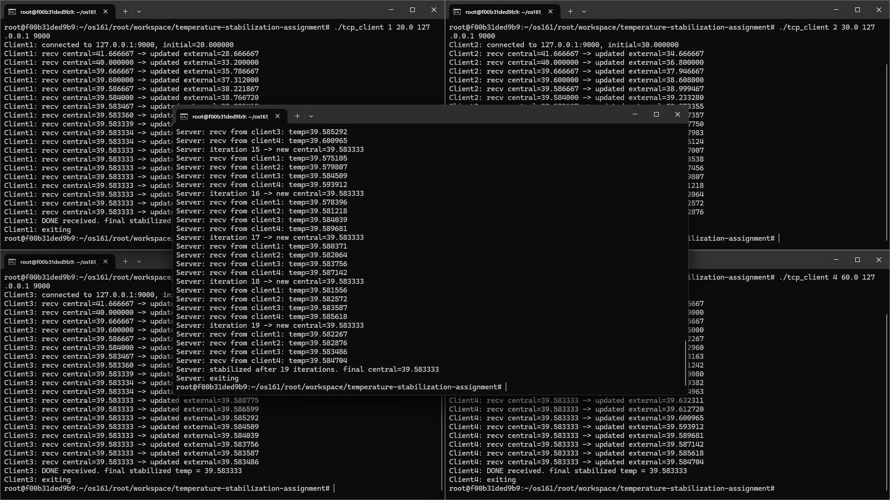

# Temperature Stabilization Assignment

This repository contains a TCP client-server implementation of the temperature stabilization protocol as described in the assignment.  
Clients represent "external" temperatures, and the server computes a new "central" temperature each iteration, repeating this process until stabilization.

## Files  
- `tcp_server.c` — server side code  
- `tcp_client.c` — client side code  

## Build Instructions  
In a terminal, compile:  
```bash
gcc -o tcp_server tcp_server.c  
gcc -o tcp_client tcp_client.c  
```

## Output Screenshot

